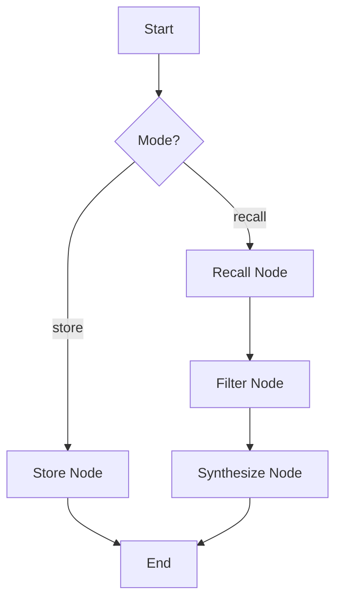

# Multi-Graph Architecture: Memory Subgraph

> **Category**: ARCHITECTURE | **Date**: 2026-01-29

# Multi-Graph Architecture: Memory Subgraph Integration

## Vision

The Omni Agentic OS evolves from a monolithic loop to a **Composable Multi-Graph Architecture**.
Specialized workflows (Tasks, Memory, Research) are encapsulated as independent graphs that can be invoked as nodes within other graphs.

## Core Concept: Subgraph Node

A "Subgraph Node" is a node in a parent graph (e.g., `RobustTaskWorkflow`) that executes a child graph (e.g., `MemoryWorkflow`).
The parent graph waits for the child graph to complete and receives its final state as output.

## Memory Workflow Design

### Purpose

To provide a unified, pluggable interface for Long-term Memory (LTM) operations: Recall, Filter, and Store.

### State Schema (`MemoryState`)

```python
class MemoryState(TypedDict):
    # Input
    query: str              # Search query or content topic
    content: str | None     # Content to store (for store mode)
    mode: str               # "recall" | "store" | "synthesize"

    # Internal
    retrieved_docs: List[Dict]
    relevance_score: float

    # Output
    final_context: str      # Formatted string for LLM injection
    storage_id: str | None  # ID of stored memory
```

### Nodes

1. **`recall_node`**:
   - Tool: `knowledge.recall` / `memory.search_memory`
   - Input: `query`
   - Action: Hybrid search across Vector Store.
2. **`filter_node`** (LLM):
   - Input: `retrieved_docs`
   - Action: Ranks and filters docs based on relevance to `query`.
3. **`store_node`**:
   - Tool: `memory.save_memory` / `knowledge.ingest`
   - Input: `content`, `query` (as tag/topic)
   - Action: Persists insight to LTM.

4. **`synthesize_node`** (LLM):
   - Input: Filtered docs
   - Action: Summarizes docs into a concise `final_context` block.

### Graph Topology



## Integration Strategy

In `RobustTaskWorkflow`:

1. **Pre-Planning (Recall)**:
   - Before `Plan` node, invoke `MemorySubgraph(mode="recall", query=user_request)`.
   - Inject `final_context` into `Plan` prompt ("Here is what we know about this task...").

2. **Post-Execution (Store)**:
   - After `Validate` (Success), invoke `MemorySubgraph(mode="store", content=summary)`.
   - Saves "Success Pattern".

3. **Error Handling (Store)**:
   - After `Reflect`, invoke `MemorySubgraph(mode="store", content=failure_analysis)`.
   - Saves "Pitfall".

## Benefits

- **Separation of Concerns**: Task logic doesn't clutter with memory API calls.
- **Reusability**: `MemoryGraph` can be plugged into `ResearchGraph`, `CodingGraph`, etc.
- **Consistency**: Unified memory protocol across the entire OS.
