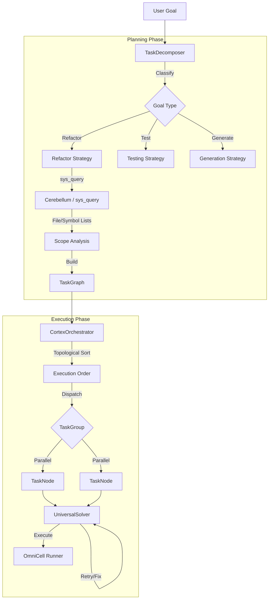

# Cortex Module: The Prefrontal Cortex of Omni Agent

> **Category**: ARCHITECTURE | **Date**: 2026-01-31

# Cortex Module: The Prefrontal Cortex of Omni Agent

## 1. Overview

The **Cortex** (`omni.agent.core.cortex`) serves as the "Prefrontal Cortex" of the Omni Agent system. It provides **Executive Function**, enabling the agent to handle complex, multi-step goals that cannot be solved by a single tool call.

It introduces a **Map-Plan-Orchestrate** paradigm:

1.  **Map**: Analyze the environment (filesystem, code structure) using `Cerebellum` (sys_query).
2.  **Plan**: Decompose the goal into a Directed Acyclic Graph (DAG) of tasks using `TaskDecomposer`.
3.  **Orchestrate**: Execute tasks with concurrency control, dependency management, and self-healing using `CortexOrchestrator`.

## 2. Architecture

The Cortex pipeline transforms a vague user intent into precise, parallel execution.

## 3. Data Structures (`nodes.py`)

The core data model is a DAG (Directed Acyclic Graph) of Tasks and Groups.

### 3.1 `TaskNode`

The atomic unit of work.

- **Attributes**:
  - `id`: Unique UUID.
  - `command`: The actual instruction/script to execute.
  - `dependencies`: List of parent task IDs.
  - `status`: `PENDING`, `RUNNING`, `SUCCESS`, `FAILED`, `BLOCKED`.
  - `priority`: `CRITICAL` (0) to `LOW` (3).
  - `retry_count` / `max_retries`: For resilience.
- **Logic**:
  - `can_execute(completed_tasks)`: Returns true only if all dependencies are in `completed_tasks`.

### 3.2 `TaskGroup`

A logical clustering of tasks that share a context or purpose.

- **Concurrency**:
  - `execute_in_parallel=True`: All tasks in the group are scheduled simultaneously (up to `max_concurrent`).
  - `execute_in_parallel=False`: Tasks run sequentially.
- **Barrier**: The group itself can depend on other groups (`depends_on`), acting as a synchronization barrier.

### 3.3 `TaskGraph`

The container and manager of the DAG.

- **Algorithms**:
  - **Topological Sort**: Kahn's algorithm to determine a valid execution order.
  - **Cycle Detection**: Prevents infinite loops in dependencies.
  - **Execution Levels**: Groups tasks into "waves" that can run purely in parallel.

## 4. The Planner (`planner.py`)

The **`TaskDecomposer`** is the intelligence that converts "Intent" into "Graph".

### 4.1 Goal Classification

Heuristics determine the strategy:

- **`refactor`**: Needs precise file finding. Strategy: One task per file.
- **`testing`**: Needs test discovery. Strategy: Parallel pytest runners.
- **`generation`**: Needs context. Strategy: Sequential (Analyze -> Generate -> Verify).

### 4.2 Scope Analysis (The "Cerebellum" Link)

Instead of hallucinating file paths, the Planner calls `sys_query` (via `Cerebellum`) to inspect the actual OS state.

- **Query**: `ls **/*.py | grep "api"` or `ast-grep pattern`
- **Result**: Real file paths (`src/api/auth.py`, `src/api/user.py`).
- **Action**: Generates a `TaskNode` for _each_ actual file found.

### 4.3 Graph Construction Strategies

- **Refactor Graph**:
  - Creates a `refactor_files` group (Parallel).
  - Adds one task per file: `sed` or `omni_edit` command.
- **Generation Graph**:
  - Creates a `code_generation` group (Sequential).
  - Task 1: Analyze (`# Analyze...`)
  - Task 2: Generate (`# Generate...`) -> Depends on Task 1.
  - Task 3: Verify (`# Verify...`) -> Depends on Task 2.

## 5. The Orchestrator (`orchestrator.py`)

The **`CortexOrchestrator`** is the runtime engine.

### 5.1 Execution Loop

1.  **Ordering**: Calculates group execution order via topological sort.
2.  **Dispatch**: Iterates through groups.
    - If **Parallel**: Spawns `asyncio.create_task` for all ready tasks, capped by `max_concurrent_tasks` (Semaphore).
    - If **Sequential**: Awaits tasks one by one.
3.  **Result Collection**: Aggregates results, duration, and errors.

### 5.2 Conflict Detection (`ConflictDetector`)

- Tracks file modifications per task.
- **Race Condition Check**: If Task A and Task B both modify `utils.py` in the same parallel batch, it flags a `file_conflict`.
- _(Future)_: Will automatically serialize conflicting tasks.

### 5.3 Resilience

- **Retries**: If a task fails, checks `retry_count`. If retries remain, re-queues the task with backoff.
- **Stop-on-Failure**: Configurable (`ExecutionConfig`). Can abort the entire graph on critical failures.

## 6. Integration with Universal Solver

The Orchestrator doesn't just run raw shell commands; it delegates to the **Universal Solver**.

- **Why?**: A simple `sed` command might fail (syntax error, permission denied).
- **Solver's Role**:
  1.  Receives the `TaskNode.command` as a goal.
  2.  Writes a specific Nushell script.
  3.  Executes.
  4.  **Self-Correction**: If stderr is non-empty, the Solver uses an LLM loop to fix the script and retry _inside_ the task execution slot.
- **Result**: The Orchestrator sees a higher success rate because tasks are "smart".

## 7. Metrics & Telemetry

Every execution produces an `ExecutionResult` containing:

- `success_rate`: Percentage of tasks completed.
- `duration_ms`: Total wall-clock time.
- `throughput`: Tasks per second (demonstrating parallelism benefits).
- `metrics`: Detailed breakdown of retries and errors.

This data is essential for the **Evolutionary Memory** (Stage 3 of Project Darwin) to learn which strategies work best.
